<h1>Sobre o Projeto</h1>

<h3>A ideia Desse projeto foi implementar um modelo conceitual
de um banco de dados em um CRUD com o JDBC puro, para que eu possa entender como funciona essas coisas por baixo de maneira mais manual. Fique à vontade para editar e melhorar o projeto.
Os próximos passos são implementar com Spring/JPA</h3>
 

<h1>Como fiz:</h1>

1. De maneira Geral, a ideia foi criar as entidades de acordo com as tabelas do banco, criar os respectivos objetos de acesso à dados (DAO), seus controladores e com uma view simples, criar a interação com o usuário.

2. Na criação do banco, criei uma <strong>trigger function</strong> que atualiza a quantidade de produtos na tabela de acordo com o tipo de movimentação que está sendo feita <strong>(IN, OUT)</strong> sempre que uma movimentação nova é gerada<strong>(create)</strong>

3. Criei também um log de movimentação para poder ter acesso a essas informações após a inserção de uma nova movimentação.

<h1>Modelo Conceitual do Banco</h1>

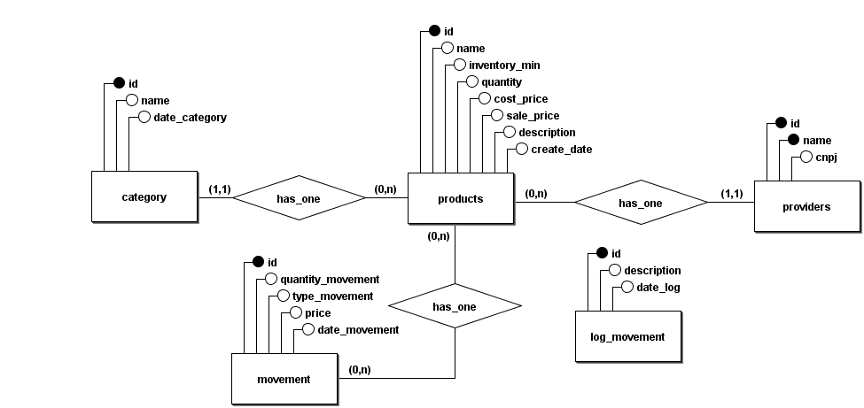

<h1>Tela Inicial</h1>
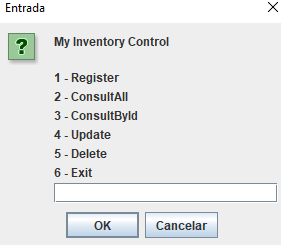

<h1>Listando Os dados</h1>

Dados no banco:
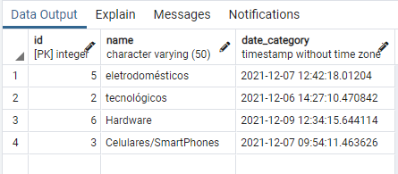

Dados na aplicação:
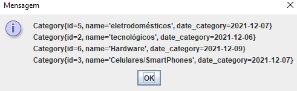

<h1>Inserindo Um novo Produto</h1>

<h3>Antes de Inserir no(a)</h3>
banco: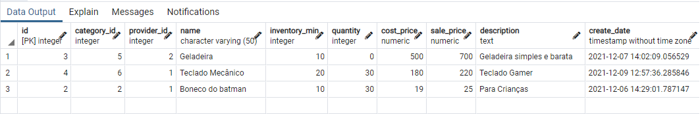 
aplicação: 
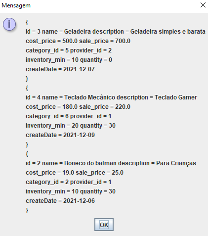

<h3>Inserindo:</h3>
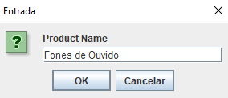
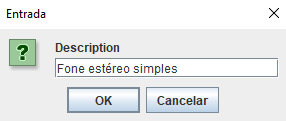
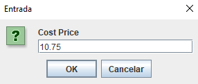
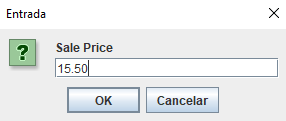
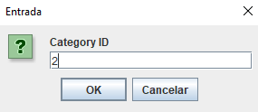
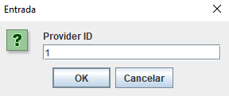
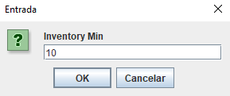

<h3>Perceba que os dados realmente foram salvos:</h3>
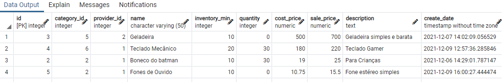

<h3>Na Aplicação:</h3>
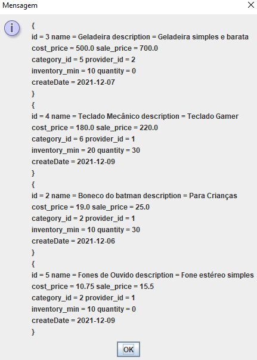
 
<h2>Todas as outras funcionalidades do CRUD estão devidamente implementadas(basta checar nos arquivos xD)</h2>